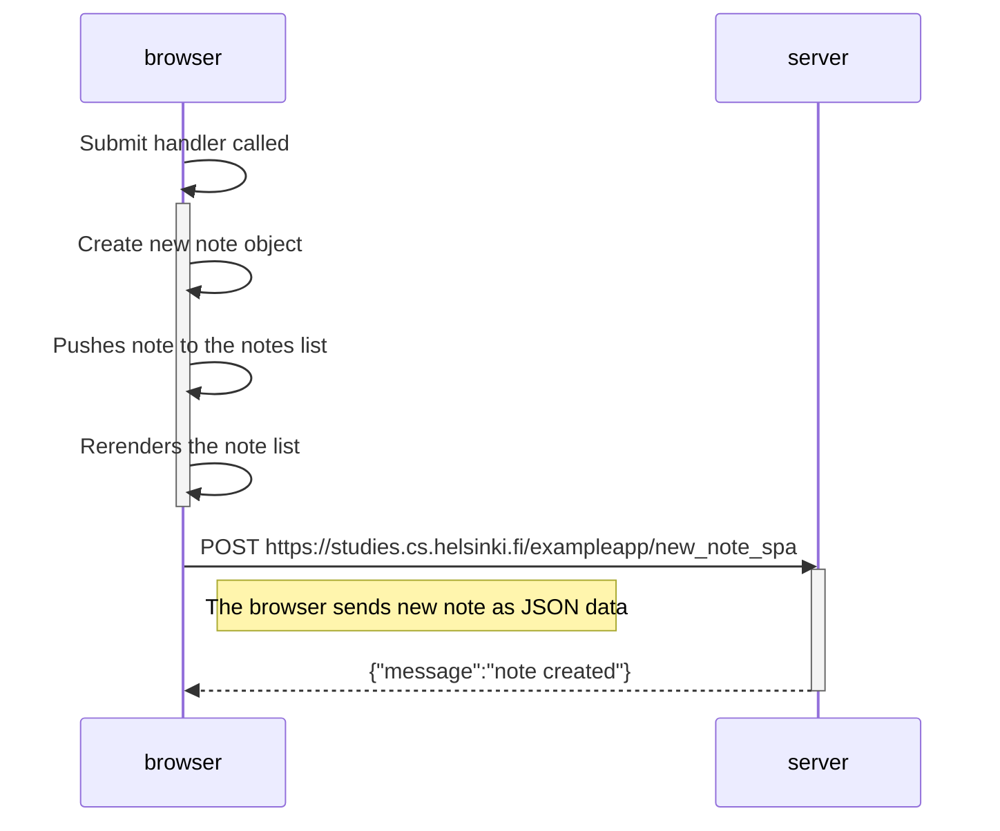

```mermaid
sequenceDiagram
    participant browser
    participant server

    browser->>browser: Submit handler called
    activate browser
    browser->>browser: Create new note object
    browser->>browser: Pushes note to the notes list
    browser->>browser: Rerenders the note list
    deactivate browser

    browser->>server: POST https://studies.cs.helsinki.fi/exampleapp/new_note_spa

    activate server
    Note right of browser: The browser sends new note as JSON data
    server-->>browser: {"message":"note created"}
    deactivate server

```
