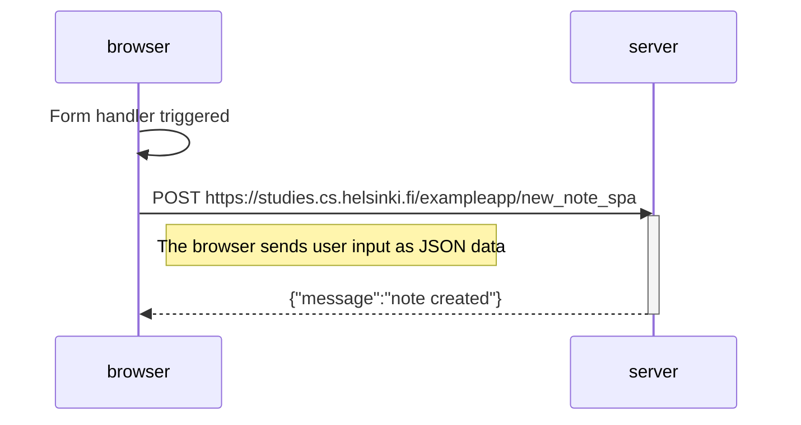

```mermaid
sequenceDiagram
    participant browser
    participant server

    browser->>browser: Form handler triggered

    browser->>server: POST https://studies.cs.helsinki.fi/exampleapp/new_note_spa
    activate server
    Note right of browser: The browser sends user input as JSON data
    server-->>browser: {"message":"note created"}
    deactivate server

```
